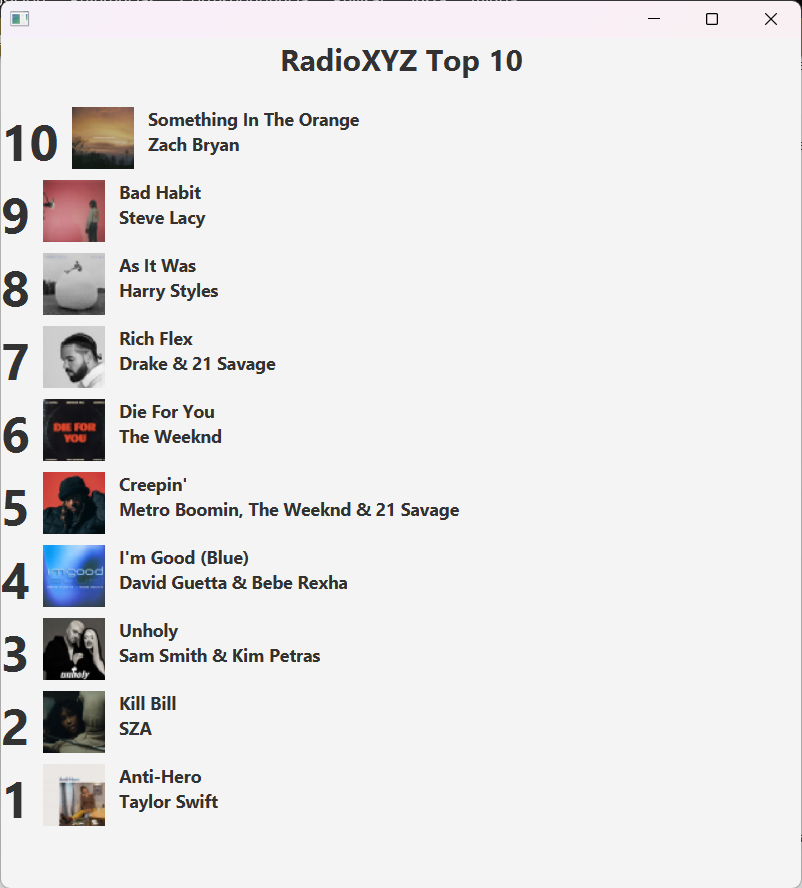

# Taller02-Ramas
Cambios realidados por Integrante:
Dentro de la clase: Cancion, se realizaron cambios y modificaciones minimas. 
El comparable de la clase Cancion fue modificado para que este vaya en un orden inverso,esto se hizo invirtiendo las posiciones de:
o.posActual y de posActual
permitiendo que el top se muestre en pantalla de forma inversa. 
Junto a este README se adjunta evidencia:

